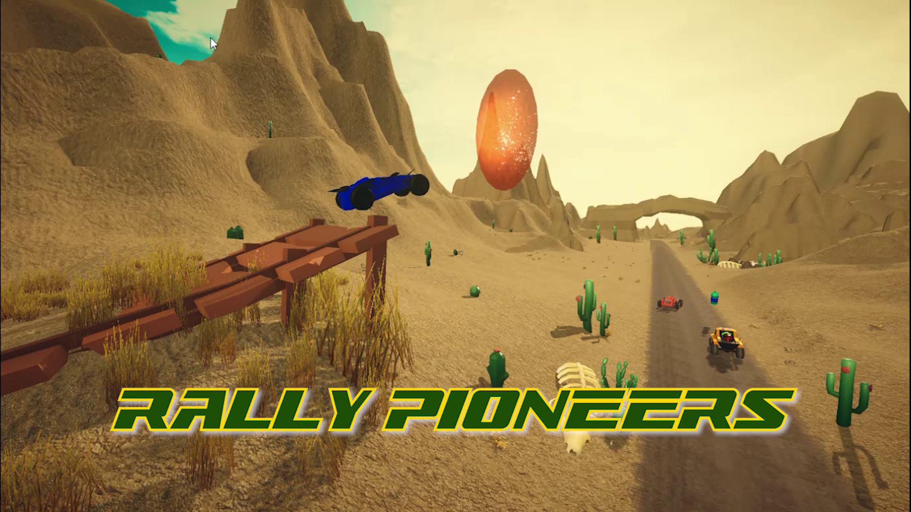
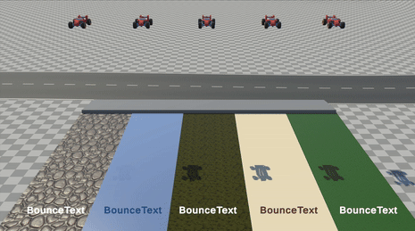

<!-- PROJECT LOGO -->

  <h3 align="center">Rally Pioneers!</h3>

  

    A 3D Racing Game developed with Unity over a span of two months
     
     
    <a href="https://youtu.be/rrk0dRZUqbY">View Game Trailer</a>
    ·
    <a href="https://github.com/vatsalunadkat/sleep-pattern-analysis/issues">Report Bug</a>
    ·
    <a href="https://github.com/vatsalunadkat/sleep-pattern-analysis/issues">Request Feature</a>
  

<!-- TABLE OF CONTENTS -->

  
Table of Contents

  <ol>
    <li>
      <a href="#about-the-project">About The Project</a>
    </li>
    <li>
      <a href="#usage">Usage</a>
      <ul>
        <li><a href="#how-to-download-and-play-the-game">How to Download and Play the Game</a></li>
      </ul>
    </li>
    <li>
      <a href="#roadmap">Roadmap</a>
      <ul>
        <li><a href="#project-timeline">Project Timeline</a></li>
        <li><a href="#main-features">Main Features</a></li>
        <li><a href="#future-scope">Future scope</a></li>
      </ul>
    </li>
    <li>
      <a href="#project-artifacts">Project Artifacts</a>
      <ul>
        <li><a href="#game-physics">Game Physics</a></li>
        <li><a href="#npc-ai">NPC AI</a></li>
        <li><a href="#game-details">Game Details</a></li>
      </ul>
    </li>
    <li><a href="#contact">Contact</a></li>
  </ol>

<!-- ABOUT THE PROJECT -->
## About The Project

  

The game's main objective is to provide an engaging and entertaining experience while demonstrating fundamental game
development concepts. The development process will involve designing and modeling 3D assets,
scripting game mechanics using C#, and integrating various components within the Unity environment.
We plan to build a functional and enjoyable racing game with progressive difficulty levels from scratch.

Developed as a part of CS 6457: Video Game Design (Summer Term 2024) - Online Master of Science in Computer Science (OMSCS)

### Built With Unity

(<a href="#readme-top">back to top</a>)

<!-- USAGE EXAMPLES -->
## Usage

### How to Download and Play the Game
<ol>
    <li> Go to the <a href='https://github.com/vatsalunadkat/RallyPioneersRacing/releases'>repository's release page</a></li>
    <li>The latest release will be at the top of the page with the `Latest` tag marked next to the name</li>
    <li>Scroll down to find the `Assets` dropdown of the release</li>
    <li>Based on the oprating system you are using download the relavent zip file - 
      <ul>
        <li>For windows - rally_pioneers_racing_windows.rar</li>
        <li>For Mac - rally_pioneers_racing_osx.rar</li>
      </ul>
    </li>
    <li>After the file has been downloaded unzip it (right click the file and select `Extract here...`)</li>
    <li>Run `PrefabPioneers_RallyPioneers.exe`</li>
    <li>In case of any crashes please file a report here - <a href="https://github.com/vatsalunadkat/sleep-pattern-analysis/issues">Report Bug</a></li>
</ol>

<!-- ROADMAP -->
## Roadmap

### Project Timeline

<table>
  <thead>
    <tr>
      <th>Week #</th>
      <th>Tasks</th>
    </tr>
  </thead>
  <tbody>
    <tr>
      <td>1</td><td>Project Pitch and Initial Prototype</td>
    </tr>
    <tr>
      <td>2</td><td>Basic Setup, Game environment, and Assets</td>
    </tr>
    <tr>
      <td>3</td><td rowspan=2>Game Logic and Physics, Character Development, and Animations</td>
    </tr>
    <tr>
      <td>4</td>
    </tr>
    <tr>
      <td>5</td><td rowspan=2>Game AI and NPC Behavior</td>
    </tr>
    <tr>
      <td>6</td>
    </tr>
    <tr>
      <td>7</td><td>User Experience/Game Feel and Playtesting</td>
    </tr>
    <tr>
      <td>8</td><td>Testing and Documentation </td>
    </tr>
  </tbody>
</table>

### Main Features
- [x] 2 Interactive 3D levels
- [x] Smart AI NPC Cars
- [x] Collectibles and obstacles
- [x] Tutorial and Achievements

### Future scope
- [ ] More levels and collectibles
- [ ] Player Car customization

See the [open issues](https://github.com/vatsalunadkat/sleep-pattern-analysis/issues) for a full list of proposed features (and known issues).

(<a href="#readme-top">back to top</a>)

<!-- OTHER ARTIFACTS -->
## Project Artifacts

### Game Physics
<table>
  <tr>
    <td align="center">Car Acceleration over different surfaces</td>
    <td align="center">Gravity and Elasticity effects</td>
  </tr>
  <tr>
    <td align="center"></td>
    <td align="center"></td>
  </tr>
</table>

### NPC AI
<table>
  <tr>
    <td align="center">Ray-trace Detection System</td>
    <td align="center">Obstacle Avoidance</td>
  </tr>
  <tr>
    <td align="center"></td>
    <td align="center"></td>
  </tr>
</table>

### Game Details

How to play and what parts of the level to observe technology requirements?

<ul>
<li>On opening the game, the main menu scene will be displayed.</li>
<li>The player can choose to start a new game with different scenes like Forest, Desert, or training scene.</li>
<li>Initially only the training and Desert levels are unlocked. The player can unlock the Forest level by finishing first in the Desert level.</li>
<li>There is also an Achievements section that shows different achievements that the player can unlock by completing certain tasks.</li>
<li>The Forest and Desert levels have AI bots that the player can fight against while the training scene is for the player to practice and get used to the controls.</li>
<li>The controls for moving the vehicle vary based on the platform. For PCs, the player uses the arrow keys:
  <ul>
    <li>Up and down arrow keys are used to move the vehicle forward and backward respectively.</li>
    <li>The left and right arrow keys are used to steer the vehicle left and right respectively.</li>
  </ul>
</li>
<li>The vehicle can be respawned by pressing the 'B' key on the keyboard, and the level can be reset by pressing the 'R' key on the keyboard. The ‘ESC’ key brings up the menu options.</li>
<li>In the game, the player needs to complete 2 laps of the track in the shortest time possible.</li>
<li>There are power-ups like speed boost, shields, and portals that the player can collect to gain an advantage over the AI bots.</li>
<li>There are also multiple obstacles like oil spills that the player needs to avoid, as hitting them will cause a temporary loss of vehicle control.</li>
</ul>

Technological Requirements met in the Game

1. **3D Game Feel**
<ul>
<li>The game has a 3D environment with 3D models for the vehicle, AI bots, power-ups, and oil spills. The player can move the vehicle in 3D space, and the camera follows the vehicle as it moves around the track. The two different 3D environments are Forest and Desert levels. The Forest level has trees, grass, and a road track while the Desert level has sand, rocks, and a sandy track. The tracks themselves have ups and downs as well as sharp turns to make the game more challenging and fun.</li>
<li>The game has a clear objective to finish 2 laps of the track in the shortest time possible. The player can see the lap count and time taken on the screen. At the end of the 2 laps, the player is shown the time taken to complete both the laps and the comparison with AI bots.</li>
<li>The player has the Start menu to start the chosen level, pause the game in between, and respawn the vehicle if it goes off the track. The vehicle can be respawned by pressing the 'B' key on the keyboard and the level can be reset by pressing the 'R' key on the keyboard.</li>
</ul>

2. **Fun Gameplay**
<ul>
<li>Players can choose from a variety of tracks, each offering unique challenges. Tracks include winding roads, elevated twists, and sharp turns to test driving skills.</li>
<li>Designed to provide a thrilling experience with dynamic and complex layouts, features such as narrow passages, steep inclines, and hairpin turns keep the race exciting.</li>
<li>AI opponents are designed to provide a challenging and competitive racing experience.</li>
<li>The tracks are populated with obstacles that players must navigate around or avoid. Elements like oil slicks and barriers add an extra layer of challenge.</li>
<li>Players can collect speed boosts to gain an advantage over opponents. Portals and other special power-ups provide unique gameplay twists and strategic options.</li>
<li>The game features realistic vehicle dynamics, including accurate acceleration, torque, and suspension behavior. Cars respond authentically to player inputs and environmental interactions, enhancing immersion.</li>
<li>Beautifully rendered environments enhance the racing experience. Detailed scenery, realistic lighting, and dynamic weather conditions make each race visually appealing and engaging.</li>
<li>The game tracks the time taken to complete each lap, adding an element of time management and efficiency. The game shows the player after-race highlights with the time taken and how the player stands in comparison to the AI NPCs.</li>
<li>The shield and boost power-ups are placed side-by-side to give the player interesting choices to make. The player can only select one at a time.</li>
<li>The player can also choose a shortcut by going off-track. This will reduce the distance, but the player's speed will be reduced due to the sand and off-road terrain.</li>
<li>The game HUD displays the current rank of the player and also has a mini-map that shows each player's position on the track.</li>
<li>The Forest level is locked initially and can be unlocked by finishing first in the Desert level. This adds a competitive element to the game and encourages players to improve their skills to unlock new content.</li>
<li>The Main Menu has an Achievements section that shows different achievements that the player can unlock by completing certain tasks. This adds replay value and encourages players to explore different aspects of the game.</li>
<li>Added background music to make the player feel more immersed in the game.</li>
</ul>

3. **3D Vehicle with Real-Time Control**
<ul>
<li>The car emulates real-world behavior with features like moving wheels and suspension movement.</li>
<li>Acceleration, vehicle torque, maximum speed, and friction are designed to replicate real-world values and behavior.</li>
<li>The car can be easily controlled using mapped keys, providing a smooth and intuitive driving experience.</li>
<li>Players can interact with various car components, including the car horn and brakes, while racing.</li>
<li>Players can engage in realistic races against AI opponents, enhancing the competitive aspect of the game.</li>
<li>AI-controlled cars exhibit distinct behaviors and strategies, providing a challenging and dynamic racing environment.</li>
<li>The player's car will interact dynamically with the environment, including obstacles and other scene elements.</li>
<li>Players can collect items like speed boosts and encounter hazards such as oil slicks.</li>
<li>The game tracks the time taken to complete each lap, adding an element of time management and efficiency.</li>
<li>A time counter displays the total time taken by the player and the NPC AI to complete the race.</li>
<li>Lap counters, current rank, and time records provide detailed feedback on performance, encouraging players to improve their skills and beat their best times.</li>
</ul>

4. **3D World with Physics and Spatial Simulation**
<ul>
<li>Racing game set in various scenes such as desert and forest tracks.</li>
<li>Realistic lighting sources and environmental physics for immersion.</li>
<li>Dynamic environmental elements like hills, trees, and sand dunes.</li>
<li>Player-interactable elements with accurate physics behaviors.</li>
<li>Collisions with scene elements cause realistic stopping and physical reactions.</li>
<li>Real-world physics simulations for environmental interactions.</li>
<li>AI cars exhibit realistic physics-based behavior on the track, including elements like acceleration, braking, and collision responses.</li>
<li>AI cars interact with the environment and other vehicles according to physical laws, enhancing the realism of the racing experience.</li>
<li>Player's car with detailed physics including moving wheels, suspension, and vehicle bounce.</li>
<li>Accurate simulation of car behavior and collisions.</li>
<li>The player car can collide with the trees and rocks on the track, it can go over small grass and even uproot medium-sized plants.</li>
<li>As the player goes off the track on the sand, we can see sand particles flying off the tires of the car.</li>
<li>NPC and player cars emit smoke from the engine as they try to accelerate or decelerate.</li>
</ul>

5. **Real-time NPC Steering Behaviors / Artificial Intelligence**
<ul>
<li>NPCs are race cars competing against the player in real-time.</li>
<li>AI cars include different types such as trucks and race cars.</li>
<li>Each vehicle type has distinct acceleration speeds and racing behaviors.</li>
<li>AI cars aim to reach the finish line before the player.</li>
<li>AI cars are programmed to handle collisions and getting stuck.</li>
<ul>
  <li>Upon collision or becoming stuck:
    <ul>
      <li>The AI car will be re-spawned back onto the track.</li>
      <li>Re-spawn points are strategically chosen to ensure smooth race continuation.</li>
    </ul>
  </li>
</ul>
<li>Vehicle-Specific Behaviors:
  <ul>
    <li>Trucks:
      <ul>
        <li>Slower acceleration but more stable handling.</li>
        <li>Favor straight paths and wider turns.</li>
        <li>Exhibit cautious overtaking maneuvers.</li>
      </ul>
    </li>
    <li>Race Cars:
      <ul>
        <li>Faster acceleration and higher top speeds.</li>
        <li>Aggressive driving with sharp turns.</li>
        <li>Focus on overtaking and maintaining the lead.</li>
      </ul>
    </li>
  </ul>
</li>
<li>AI Logic:
  <ul>
    <li>The AI uses a waypoint system, similar to Milestone 4, to navigate the racetrack. This system directs the agent to follow a set sequence of checkpoints, ensuring lap validity and guiding the agent back on track if they deviate from the racing line. To navigate the racetrack, the agent receives directions to the next waypoint and applies a set torque to the wheel collider motors.</li>
    <li>Each agent vehicle is equipped with eleven “sensors” that use physics raycasting for obstacle and vehicle avoidance. Five front sensors detect collisions with objects (excluding terrain) and adjust the steering angle based on their positions. For example, if the front-right sensor detects an obstacle, a negative float value is added to the steering angle to turn the vehicle left. The same logic applies to the front-left sensors. As a failsafe, if the total angle value is zero and the center sensor detects a collision, the agent uses the collision surface’s normal to set an extreme steering angle to avoid a head-on collision. The remaining six sensors, placed on each side of the vehicle, ensure a safe gap between vehicles.</li>
    <li>The agent also includes logic to avoid potential deadlocks. If the agent remains stationary for an extended period, it will attempt to free itself by briefly reversing and then moving forward. If reversing does not resolve the issue, the vehicle will be respawned to its last visited waypoint. To handle edge cases where the agent might get stuck in a continuous loop of reversing and moving forward, the agent is automatically respawned to its last visited waypoint if it fails to cover a certain distance within a set timeframe.</li>
    <li>Sensory feedback of the AI: Currently, the only sensory feedback the AI provides is through its obstacle avoidance and reversal mechanisms.</li>
    <li>The NPC cars have a state machine implementation that controls their behavior. The states include Idle, FollowPath, AvoidObstacles, and ReverseCar.</li>
  </ul>
</li>
</ul>

6. **Polish**
<ul>
<li>Main Menu and Navigation
  <ul>
    <li>The game has a main menu with options to start the game, choose levels, and exit.</li>
    <li>Players can select from Forest, Desert, and Training levels. The levels are ranked and renamed based on their difficulty.</li>
    <li>A pause menu, accessible with the 'Esc' key, includes buttons to restart the level, return to the main menu, and exit the game.</li>
  </ul>
</li>
<li>Visual and Audio Enhancements
  <ul>
    <li>Smooth transition effects for collectibles like power-ups enhance the visual appeal.</li>
    <li>The vehicle engine sound dynamically adjusts according to the speed of the vehicle, providing a more immersive experience.</li>
  </ul>
</li>
<li>Gameplay Interaction
  <ul>
    <li>Players can interact dynamically with the environment, including obstacles and other scene elements.</li>
    <li>Collecting items like speed boosts and encountering hazards such as oil slicks adds strategic depth to the gameplay.</li>
  </ul>
</li>
<li>Time Tracking and Performance
  <ul>
    <li>The game tracks the time taken to complete each lap, displaying lap and race times, and providing post-race highlights comparing player performance to AI opponents.</li>
  </ul>
</li>
<li>Track Variety and Challenges
  <ul>
    <li>Players can choose from a variety of tracks, each offering unique challenges with dynamic and complex layouts, including winding roads, elevated twists, and sharp turns.</li>
  </ul>
</li>
<li>AI and Competitive Experience
  <ul>
    <li>AI opponents provide a challenging and competitive racing experience with distinct behaviors and strategies.</li>
  </ul>
</li>
<li>Player Convenience
  <ul>
    <li>Players can respawn their vehicle if it goes off track by pressing the 'B' key, ensuring they never get stuck and can easily continue racing.</li>
    <li>As the player goes off the track on the sand, we can see sand particles flying off the tires of the car.</li>
    <li>NPC and player cars emit smoke from the engine as they try to accelerate or decelerate.</li>
    <li>The game HUD displays the current rank of the player and also has a mini-map that shows each player's position on the track.</li>
  </ul>
</li>
</ul>

7. **Known Problem Areas**
<ul>
<li>Issue 1: Gamepad disconnections require level reload
  <ul>
    <li>Description: The game does not handle gamepad disconnections gracefully during gameplay. Removing the gamepad while the game is running causes unexpected results and loss of control from the gamepad.</li>
    <li>Workaround: To restore normal behavior, the player must reload the level or restart the game.</li>
  </ul>
</li>
<li>Issue 2: Keyboard input with Gamepad Connected
  <ul>
    <li>Description: The game currently prioritizes gamepad input over keyboard input. As a result, when a gamepad is connected, keyboard controls for player movement become unresponsive.</li>
    <li>Workaround: The only workaround is to disconnect the gamepad to enable keyboard input.</li>
  </ul>
</li>
</ul>

<!-- CONTACT -->
## Contact

Vatsal Paresh Unadkat - vunadkat6@gatech.edu
LinkedIn Profile: [https://github.gatech.edu/vunadkat6/sleep-pattern-analysis](https://www.linkedin.com/in/vatsalunadkat/)

(<a href="#readme-top">back to top</a>)

<!-- MARKDOWN LINKS -->
[React.js]: https://img.shields.io/badge/React-20232A?style=for-the-badge&logo=react&logoColor=61DAFB
[React-url]: https://reactjs.org/
